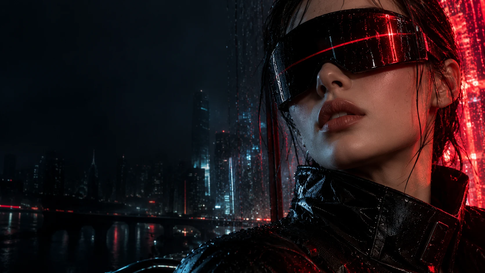
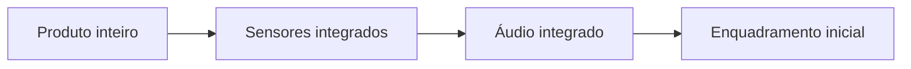
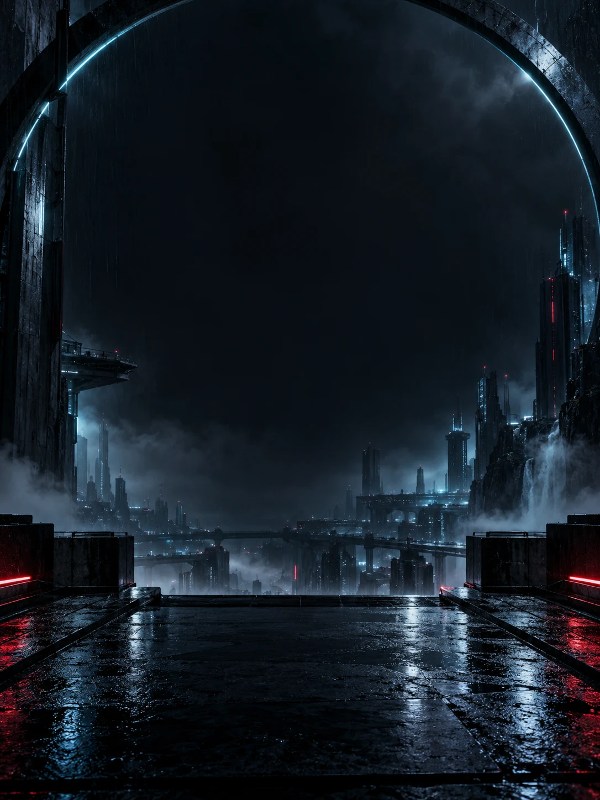
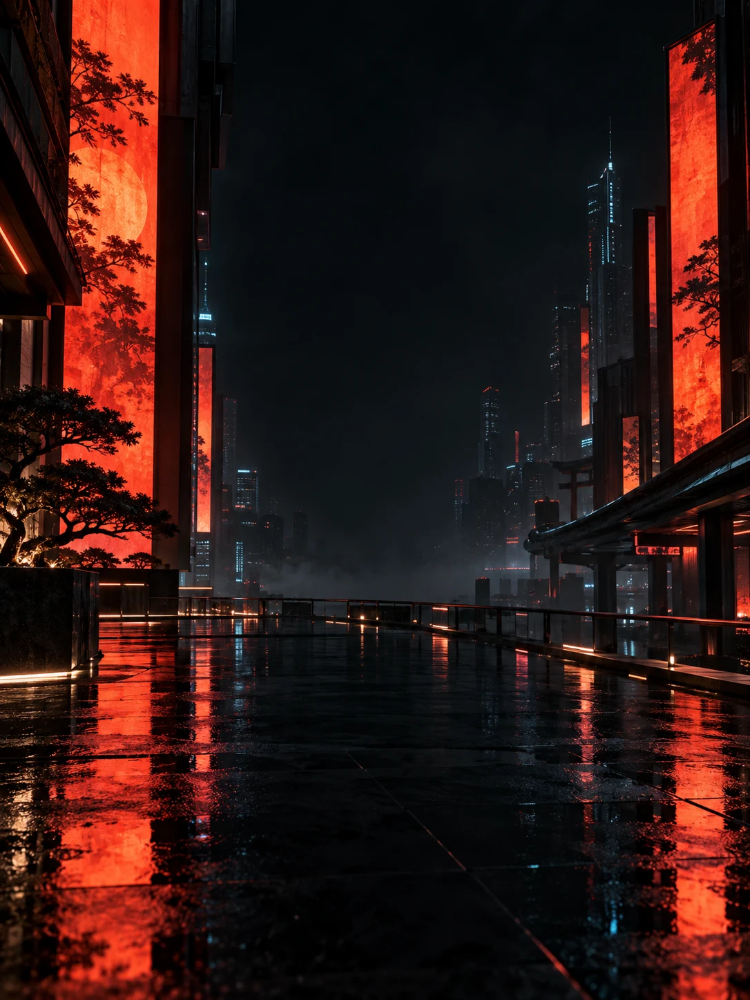
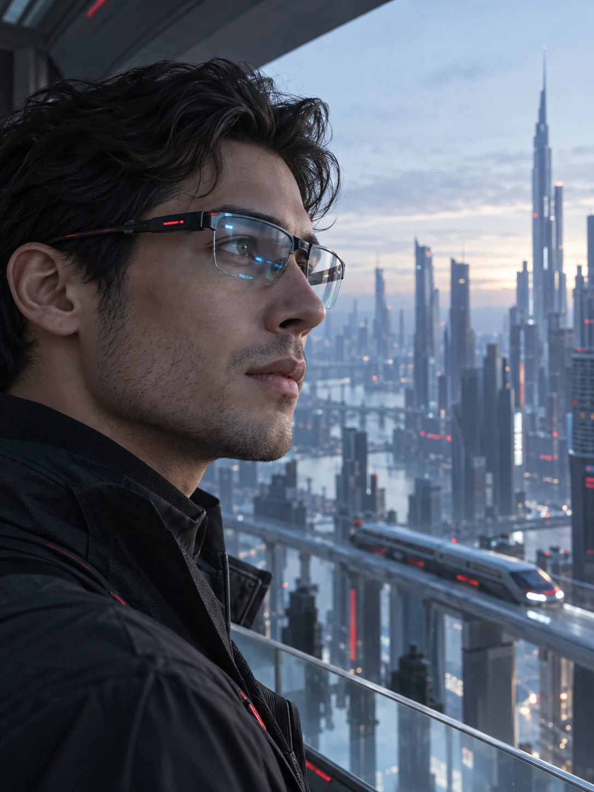

<div align="center">


# OTHER EYES

### VEJA ALÉM.

Uma concept store de óculos tecnológicos.<br>
Cyberpunk, narrativa por scroll e detalhes que parecem projetados no ar.

**HTML · CSS · JavaScript · Sketchfab Viewer API · Vite**

[Experiência](#a-experiência) · [Galeria](#universos-visuais) · [Executar](#executar-localmente) · [Estrutura](#estrutura-do-projeto) · [Créditos](#créditos)

</div>



> **Concept project.** Loja fictícia criada para explorar direção de arte, integração de modelos 3D e interfaces narrativas. Produtos, benefícios e preços compõem a proposta criativa. Não há pagamentos ou pedidos reais.

## O conceito

**Tecnologia que muda o olhar — e também a forma de apresentar um produto.**

OTHER EYES combina uma campanha cinematográfica com uma apresentação guiada de óculos tecnológicos. O visitante entra pelo universo visual, conhece os detalhes do Orbit através da rolagem e encontra duas interpretações distintas da coleção: Sight e Everyday.

A identidade usa vermelho, azul-gelo e preto profundo. Um núcleo óptico circular conecta a marca ao favicon e aos elementos gráficos. A tipografia alterna títulos condensados com textos legíveis e pequenas informações técnicas.

## A experiência

| Capítulo | O que acontece |
| :--- | :--- |
| **01 — Veja além** | Hero com arte de campanha original e mensagem curta. |
| **02 — Entre em outra órbita** | O Orbit branco permanece em cena enquanto o scroll apresenta o produto, os sensores e o áudio. |
| **03 — Mais mundo. Menos limites.** | Benefícios apresentados com uma imagem exclusiva e conteúdo editorial. |
| **04 — Dois universos** | Sight e Everyday ocupam ambientes próprios, com cores, enquadramentos e informações distintas. |
| **05 — Seu próximo olhar** | Seleção demonstrativa de produtos com inclusão, remoção e total ilustrativo. |

### Orbit: a câmera faz parte da história



A seção usa `position: sticky` e a rolagem nativa da página. O progresso escolhe quatro paradas de câmera; as transições são executadas pelo visualizador. Ao subir a página, a sequência é percorrida no sentido inverso.

- O primeiro enquadramento é armazenado para restaurar a câmera no final.
- Os closes usam as anotações reais do modelo no Sketchfab.
- A interação manual da câmera é desativada durante a apresentação.
- Um link permite continuar diretamente para o produto.
- Com movimento reduzido ativado, as transições de câmera são imediatas.

### Informações projetadas sobre o produto

Nos closes, um marcador circular e uma linha conectam a peça a uma chamada translúcida. O texto muda entre sensores e áudio.

A posição é calculada com `getWorldToScreenCoordinates()`, usando a anotação do modelo. A projeção é atualizada em até 10 ciclos por segundo durante os detalhes. As chamadas desaparecem na visão completa ou quando o ponto está fora da área visível.

## Universos visuais

<table>
  <tr>
    <td width="50%"></td>
    <td width="50%"></td>
  </tr>
  <tr>
    <td><strong>SIGHT</strong><br>Arquitetura, azul-gelo e realidade aumentada.</td>
    <td><strong>EVERYDAY</strong><br>Vermelho, vida urbana e conexão cotidiana.</td>
  </tr>
</table>

<details>
<summary><strong>Ver a arte da seção de benefícios</strong></summary>
<br>


</details>

*As imagens acima são as artes utilizadas no site, não capturas da interface renderizada.*

## Recursos implementados

- Layout responsivo, com coleção empilhada no mobile.
- Três modelos 3D incorporados via Sketchfab Viewer API.
- Sequência do Orbit guiada pela rolagem.
- Chamadas holográficas conectadas às peças.
- Ajustes de câmera, iluminação e pós-processamento dos modelos.
- Carregamento dos visualizadores próximo à área visível com `IntersectionObserver`.
- Mensagens de erro e opção de tentar novamente.
- Seleção demonstrativa em um diálogo nativo, com remoção e cálculo do total.
- Feedback de ações com região `aria-live`.
- Links de navegação, foco visível e suporte a movimento reduzido.
- Imagens WebP e carregamento adiado nas seções inferiores.

## Stack

| Tecnologia | Papel |
| :--- | :--- |
| **HTML5** | Estrutura semântica e diálogo de seleção. |
| **CSS3** | Identidade, responsividade, cena sticky e camadas holográficas. |
| **JavaScript** | Estado da seleção, progresso do scroll e comunicação com os modelos. |
| **Sketchfab Viewer API 1.12.1** | Renderização externa, anotações e controle de câmera. |
| **Vite 8.0.13** | Servidor de desenvolvimento local. |
| **Google Fonts** | Barlow, Barlow Condensed e IBM Plex Mono. |

O projeto não usa React, banco de dados ou backend. A pasta `dist/` contém o site estático pronto; neste projeto ela é editada diretamente, apesar do nome normalmente associado a arquivos de build.

## Executar localmente

### Requisitos

- Node.js **22.12 ou superior**, ou uma versão 20.x a partir de **20.19**.
- npm.
- Navegador com WebGL disponível para os modelos 3D.
- Conexão com a internet para Sketchfab e Google Fonts.

### Instalação

Extraia o ZIP e abra o terminal na pasta que contém `package.json`:

```bash
npm ci
npm run dev
```

Abra o endereço informado pelo Vite no terminal. Encerre o servidor com `Ctrl+C`.

### Verificação de sintaxe

```bash
npm run check
```

Esse comando verifica a sintaxe do JavaScript. Ele não executa testes de navegador nem valida a renderização WebGL.

### Alternativa sem Node.js

Se você já possui Python instalado, pode servir diretamente os arquivos estáticos:

```bash
python -m http.server 8000 --directory dist
```

Acesse `http://localhost:8000`. Use um servidor local em vez de abrir o HTML pelo protocolo `file://`.

## Estrutura do projeto

| Caminho | Conteúdo |
| :--- | :--- |
| `README.md` | Apresentação, instruções e créditos. |
| `package.json` | Dependência de desenvolvimento e comandos. |
| `package-lock.json` | Versões fixadas das dependências. |
| `vite.config.js` | Configuração mínima do servidor local. |
| `dist/index.html` | Conteúdo, seções, modelos e diálogo. |
| `dist/style.css` | Estilos, responsividade e efeitos visuais. |
| `dist/app.js` | Seleção, Sketchfab, scroll e projeção das informações. |
| `dist/icon.svg` | Símbolo óptico usado como favicon. |
| `dist/assets/` | Artes originais em WebP. |

## Personalizar

| Alteração | Onde editar |
| :--- | :--- |
| Títulos, descrições e textos das seções | `dist/index.html` |
| Paleta, tipografia e composição | Variáveis e seletores em `dist/style.css` |
| Modelos, nomes e valores da seleção | Objeto `models` em `dist/app.js` |
| Preços apresentados nas seções | `dist/index.html` — manter alinhados com `models` |
| Textos e pontos dos hologramas | `hologramData` em `dist/app.js` |
| Etapas da apresentação | `phaseForProgress()` e `applyOrbitPhase()` |
| Extensão da sequência de scroll | `.orbit-journey` em `dist/style.css` |
| Imagens | Arquivos em `dist/assets/` e respectivas referências no HTML |

Ao trocar o modelo Orbit, revise as anotações, as coordenadas dos pontos e a sequência de câmera. Os pontos de fallback foram definidos especificamente para o modelo atual.


## Dependências externas e limites

**Modelos externos.** As geometrias e texturas 3D são carregadas pelo Sketchfab; não estão incluídas no ZIP. A disponibilidade dos modelos depende dos autores e da plataforma.

**Interface do visualizador.** O código solicita fundo transparente e redução de elementos de interface. Alguns recursos dependem das permissões e do plano associados ao modelo. Créditos, menus ou a marca do Sketchfab podem continuar visíveis.

**Loja demonstrativa.** A seleção existe somente em memória e é apagada ao recarregar a página. Não há checkout, pagamento, cadastro ou persistência de pedidos.

**Compatibilidade.** Sem WebGL ou acesso ao Sketchfab, o site apresenta mensagens de indisponibilidade. As artes e o conteúdo continuam locais, mas a experiência completa de 3D requer esses serviços.

## Validação

Durante o desenvolvimento foram realizadas verificações de sintaxe, referências locais, identificadores HTML e lógica com API simulada. As verificações de lógica cobriram etapas de scroll, retorno da câmera, carregamento tardio e projeção das chamadas.

**Limite conhecido:** o ambiente de desenvolvimento não oferecia renderização WebGL. A aparência final dos modelos, a precisão dos pontos projetados e as transições reais de câmera precisam ser conferidas em um navegador com suporte a 3D. Essas verificações simuladas não constituem uma suíte automatizada incluída no pacote.

Antes de apresentar o projeto, confira:

- A sequência completa do Orbit ao descer e subir a página.
- O alinhamento das chamadas com sensores e fones.
- A composição em desktop e mobile.
- A seleção e a remoção dos produtos.
- O comportamento com movimento reduzido e eventuais falhas de carregamento.

## Créditos

**Projeto e direção criativa:** Gabriel Almeida, com apoio de IA na implementação e na criação das artes de campanha.

| Nome na concept store | Modelo original | Autor |
| :--- | :--- | :--- |
| Orbit | [Minimalistic VR Glasses](https://sketchfab.com/3d-models/minimalistic-vr-glasses-69401ad8d4fa435987ae056cfc559573) | [FoxFX](https://sketchfab.com/FoxFXMD) |
| Sight | [AR Glasses](https://sketchfab.com/3d-models/ar-glasses-9f10cc6a97e74d8082e368e66b075860) | [Philip Wang](https://sketchfab.com/getonwind) |
| Everyday | [Smart Glasses Concept Design](https://sketchfab.com/3d-models/smart-glasses-concept-design-d4f3e1fdfc8543a1aa6324da9c1cbef9) | [GuillaumeDGNS](https://sketchfab.com/GuillaumeDGNS) |

Os nomes comerciais Orbit, Sight e Everyday pertencem à narrativa fictícia desta interface e não representam produtos oficiais dos artistas.

**Imagens de campanha:** criadas com IA para o projeto. As representações nas imagens não são reproduções técnicas dos modelos 3D incorporados.

**Referências de documentação:** [Sketchfab — inicialização](https://sketchfab.com/developers/viewer/initialization) · [Sketchfab — funções](https://sketchfab.com/developers/viewer/functions).

### Licenciamento

Este pacote não define uma licença aberta para o código. Os modelos externos e demais recursos de terceiros mantêm suas próprias condições de uso. Os links de crédito não transferem direitos sobre esses materiais; consulte as respectivas páginas antes de reutilizá-los em outro contexto.

---

<div align="center">

**OTHER EYES — Veja além.**

Conceito, interface e experimentação 3D.

</div>
